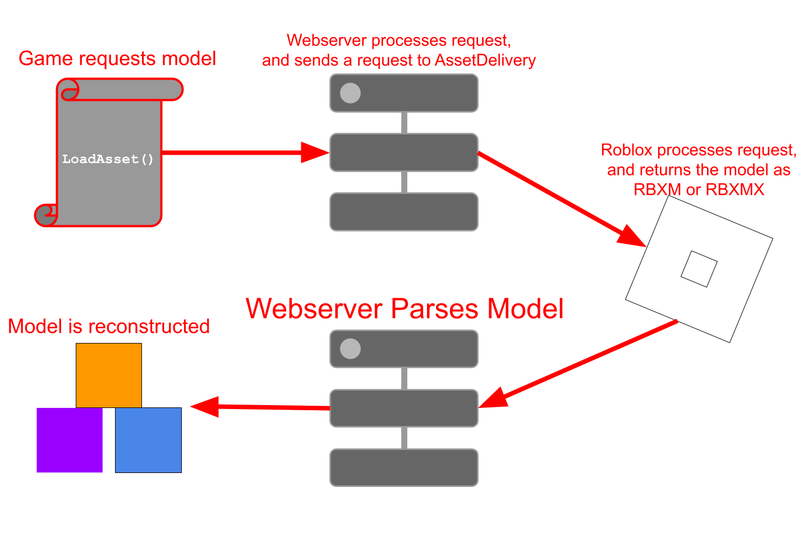

# Insert Cloud Reborn (insertapiv3)

**An alternative to the Roblox `InsertService` & `AssetService:LoadAssetAsync()`**

This module and webservice provide a way to load Assets, such as Models,Decals, <br/>
and Audio, from Roblox's CDN without using the built-in `InsertService` or<br/> `AssetService:LoadAssetAsync()`.<br/>
This can be useful for developers who want to avoid certain limitations or restrictions<br/>
imposed by Roblox on these services. (ex. Insert Wars) <br/>
However it is not without its own limits, for example not all properties are supported yet,<br/>
and some assets may not load correctly due to Roblox's security measures.<br/>
## Features
- Load Models, Decals, Audio, and other asset types directly from Roblox's CDN.
- Supports a wide range of asset types including Models, Decals, Audio, Meshes, and more.
- Avoid certain restrictions of `InsertService` and `AssetService:LoadAssetAsync()`,<br/>
and also lets you load assets in environments where these services are not available.
- Built in Sandboxer for sandboxing models to prevent exploits and other issues
- Easy to use API for loading assets by their Asset ID.
- Lightweight webservice that can be hosted on your own server or a cloud platform.<br/>
*Bandwidth costs depending on your hosting provider and usage.*
- Caches downloaded assets to improve performance and reduce bandwidth usage.<br/>
*You will need to allocate at least **16 GB** of storage for the asset cache.*
- Supports loading assets into a specified parent instance in Roblox.
- Open source and customizable to fit your specific needs.
- Regularly updated to support new asset types and features.
- Provides detailed error messages and logging for troubleshooting.
- Compatible with Roblox Studio and Roblox games.
- Easy to configure and integrate into existing projects.
- Actively maintained with a community of developers contributing to its improvement.
- Easy to use blocklist system to prevent loading of unwanted assets.

## Diagram


## Installation
1. Clone or download the repository from GitHub.
2. Set up the webservice on your own server or use a hosting service<br/>
that supports Go web applications.
3. Include the module in your Roblox project.
4. Configure the module to point to your webservice URL.

**IMPORTANT**<br/>
This is primarily designed to be used with a self-hosted webservice.<br/>
Using a public webservice may lead to unexpected downtime or rate limiting.<br/>
If you choose to use a public webservice, ensure you trust the provider<br/>
and understand the potential risks involved.<br/>
Also this webservice is NOT designed to be ran on Windows servers due to the way<br/>
file locking is handled. Use a Linux based server for best results.<br/>
However if you do build it on Windows, it has ANSI support.<br/>

## Usage
### Webservice Setup
This application is a Golang webserver.
If you do not have a build here are the steps to set it up:
1. Ensure you have go installed on your server
2. Build the application with `go build -o app . `
3. Run the created binary
**Production or Local**
```
./app
```
#### REQUIRED ENVIRONMENT VARIABLES:
- `RBX_API_KEY` - A Roblox Open Cloud API Key with the scopes `asset:read` and `legacy-asset:manage`

The webservice will be available at `http://localhost:5000` by default when using Local
### Roblox Module Usage
1. Require the module in your Roblox script.
2. Use the `LoadAssetAsync` function to load an asset by its Asset ID.
```lua
local InsertCloud = require(path.to.InsertCloud.Module)
local assetId = 123456789 -- Replace with your asset ID
local parentInstance = workspace -- Replace with the desired parent instance
local buildParent=game:GetService("ReplicatedStorage") -- Optional: Replace with the desired build parent instance
local url="https://your-webservice-url.com/api/v3/asset" -- Replace with your webservice URL, default path for asset loading is /api/v3/asset/<assetId>?placeId=<placeId>
local asset,err = InsertCloud:LoadAssetAsync(url,assetId,buildParent) --Recommended to build the asset in a service like ReplicatedStorage first
if err then
    print("Error info was returned");
else
    InsertCloud:compile_asset(asset,parentInstance) --Then compile it to the desired parent instance
end;

```

### Limitations
- Not all asset properties are supported yet.
- Some assets may not load correctly due to Roblox's security measures.
- Performance may vary based on the webservice hosting and network conditions.

## Contributing

Contributions are welcome! Please fork the repository and submit a pull request with your changes.
## License

This project is licensed under the MIT License. See the LICENSE file for details.

## Lineage

This project began as a conceptual fork of [Lunascaped/Insert-Cloud](https://github.com/Lunascaped/Insert-Cloud), but has since been fully rewritten from the ground up. No original source code remains except for microscopic references to the original.

## Requirements
- Go 1.26.3 or higher for the webservice.
- Roblox Studio for using the module in your projects.
- A Roblox API key for accessing the asset delivery API.<br/>
Permissions required: `legacy-asset: manage` and `asset: read`<br/>
For instructions on how to generate an api key go to [Roblox's Documentation](https://create.roblox.com/docs/cloud/auth/api-keys)<br/>

## Disclaimer
This module and webservice are not affiliated with or endorsed by Roblox Corporation.<br/>
Use at your own risk, although nobody has been banned for making their own `InsertService`.<br/>
However, please ensure that you comply with Roblox's Terms of Use and Community Standards<br/>
when using this module.<br/>
**THIS DOES NOT ALLOW CIRCUMVENTING PAID ASSETS OR LOADING ASSETS YOU DO NOT OWN THAT ARE NOT PUBLIC.**
